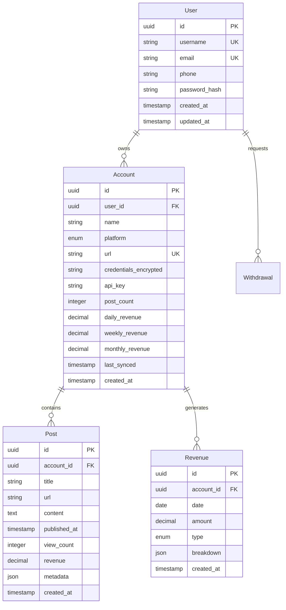

# 블로그 배포 시스템 기획서 v2.0

## 📋 프로젝트 개요

**프로젝트명**: 블로그 배포 시스템 (Blog Deployment System)  
**목적**: 블로그 운영자가 여러 블로그 계정을 관리하고, 배포 현황 및 수익을 한눈에 확인할 수 있는 통합 관리 시스템  
**핵심 가치**: 
- 🎯 다중 플랫폼 통합 관리
- 💰 실시간 수익 모니터링
- 📱 모바일 우선 설계
- 📊 데이터 기반 의사결정 지원

---

## 🎯 핵심 기능

### 1. 사용자 인증 시스템

#### 1.1 회원가입
- **필수 입력 필드**:
  - 아이디 (중복 확인 기능)
  - 비밀번호 (최소 8자, 특수문자 포함)
  - 휴대폰 번호 (SMS 인증)
  - 이메일 (이메일 인증)
- **보안 기능**:
  - 비밀번호 강도 체크
  - 이중 인증 옵션
  - 암호화된 데이터 저장
- **UI/UX**:
  - 그라데이션 배경 (인디고 → 보라 → 핑크)
  - 실시간 유효성 검증
  - 진행 표시기

#### 1.2 로그인
- **기능**:
  - 아이디/비밀번호 로그인
  - 소셜 로그인 (향후 구현)
  - 자동 로그인 옵션
  - 비밀번호 찾기/재설정
- **보안**:
  - JWT 토큰 기반 인증
  - 세션 타임아웃
  - 로그인 시도 제한

---

### 2. 대시보드 (메인 화면)

#### 2.1 레이아웃 구조
```
┌─────────────────────────────────────────────┐
│                   헤더                       │
├──────┬──────────────────────────────────────┤
│      │                                      │
│  네  │         수익 요약 카드 (4개)          │
│  비  │                                      │
│  게  ├──────────────────────────────────────┤
│  이  │                                      │
│  터  │         블로그 계정 리스트            │
│      │                                      │
└──────┴──────────────────────────────────────┘
```

#### 2.2 수익 요약 카드
| 카드명 | 아이콘 | 색상 | 표시 정보 | 특별 기능 |
|--------|--------|------|-----------|-----------|
| **오늘 수익** | 💵 달러 | 녹색 | 당일 총 수익 | 실시간 업데이트 |
| **주간 수익** | 📈 차트 | 파란색 | 최근 7일 합계 | 주별 비교 |
| **월간 수익** | 📅 달력 | 보라색 | 선택한 월 수익 | **월별 필터 드롭다운** |
| **출금 가능** | 💳 지갑 | 그라데이션 | 월 수익의 80% | 출금 신청 버튼 |

##### ⭐ 월간 수익 카드 특별 기능
- **월별 선택 드롭다운**: 최근 12개월 데이터 조회
- **전월 대비 증감률**: 
  - 상승 시: 🟢 녹색 배지 + ↑ 화살표
  - 하락 시: 🔴 빨간색 배지 + ↓ 화살표
- **비주얼 효과**: 보라색 원형 패턴 배경

#### 2.3 블로그 계정 리스트
- **표시 정보**:
  ```
  ┌─────────────────────────────────────┐
  │ 📝 블로그 이름        일 15,000원   │
  │ 🏷️ 플랫폼            주 105,000원   │
  │ 📊 234 포스트        월 450,000원   │
  └─────────────────────────────────────┘
  ```
- **인터랙션**:
  - 호버 시 테두리 색상 변경
  - 클릭 시 상세 페이지 이동
  - 스와이프 제스처 (모바일)

#### 2.4 고급 필터 기능
- **플랫폼 필터**:
  - ✅ 전체
  - 📝 네이버 블로그
  - 💭 티스토리
  - 🔧 벨로그
  - ☕ 브런치
- **정렬 옵션**:
  - 💰 수익 높은 순
  - 📊 포스트 많은 순
  - 🔤 이름순
  - 📅 최근 업데이트순
- **필터 UI**:
  - 접이식 패널 디자인
  - 필터 적용 개수 표시
  - 원클릭 초기화

---

### 3. 네비게이션 시스템

#### 3.1 데스크톱 네비게이터
```
┌──────────────┐
│ 🏠 대시보드   │ ← 활성 상태 (인디고 배경)
├──────────────┤
│ 📊 계정 관리  │
├──────────────┤
│ 💳 수익 관리  │
├──────────────┤
│ ⚙️ 설정      │
├──────────────┤
│              │
│   [프로필]   │
│   홍길동     │
│ admin@blog   │
│ [로그아웃]   │
└──────────────┘
```

#### 3.2 모바일 네비게이터
- **햄버거 메뉴**: 좌측 상단 ☰ 버튼
- **슬라이드 애니메이션**: 300ms ease-in-out
- **오버레이**: 반투명 검정 배경
- **제스처**: 스와이프로 닫기

---

### 4. 계정 추가 시스템

#### 4.1 플랫폼 선택 UI
```
┌─────────┬─────────┬─────────┬─────────┐
│   📝    │   💭    │   🔧    │   ☕    │
│ 네이버  │티스토리 │  벨로그 │ 브런치   │
└─────────┴─────────┴─────────┴─────────┘
```

#### 4.2 입력 폼 구조
1. **기본 정보** (필수)
   - 블로그 이름
   - 블로그 URL
   - 카테고리 선택

2. **인증 정보** (선택)
   ```
   ℹ️ 자동 포스팅을 위한 정보입니다.
   🔒 256-bit AES 암호화로 안전하게 보호됩니다.
   - 아이디/이메일
   - 비밀번호
   ```

3. **API 연동** (고급)
   - API 키
   - 시크릿 키
   - 웹훅 URL

#### 4.3 유효성 검증
- **실시간 검증**:
  - URL 형식 체크
  - 중복 계정 확인
  - 연결 테스트
- **에러 메시지**:
  - 인라인 에러 표시
  - 툴팁 도움말

---

### 5. 계정 상세 페이지

#### 5.1 수익 대시보드
```
╔═══════════════════════════════════════╗
║     💰 계정 수익 현황                  ║
╠═══════════════════════════════════════╣
║  오늘: 15,000원 | 주: 105,000원       ║
║  월: 450,000원  | 연: 5,400,000원     ║
╚═══════════════════════════════════════╝
```

#### 5.2 보기 모드
- **주간별 보기**: 최근 4주 데이터
- **월별 보기**: 최근 12개월 데이터
- **커스텀 기간**: 날짜 선택기

#### 5.3 배포 글 목록
```
┌──────────────────────────────────────────┐
│ 📄 서울 핫플 맛집 10선                    │
│ 📅 2025-11-10 | 👁️ 1,543 | 💰 +5,000원  │
├──────────────────────────────────────────┤
│ 📄 제주도 숨은 카페 추천                   │
│ 📅 2025-11-09 | 👁️ 2,891 | 💰 +8,500원  │
└──────────────────────────────────────────┘
```

---

## 🎨 디자인 시스템

### 색상 팔레트

#### Primary Colors
```css
--primary-indigo: #4F46E5;
--primary-purple: #9333EA;
--gradient: linear-gradient(to right, #4F46E5, #9333EA);
```

#### Semantic Colors
```css
--success: #10B981;  /* 녹색 - 수익 증가, 성공 */
--info: #3B82F6;     /* 파란색 - 정보, 주간 데이터 */
--warning: #F59E0B;  /* 노란색 - 경고, 주의 */
--danger: #EF4444;   /* 빨간색 - 에러, 수익 감소 */
```

#### Neutral Colors
```css
--gray-50: #F9FAFB;   /* 배경 */
--gray-100: #F3F4F6;  /* 카드 배경 */
--gray-600: #4B5563;  /* 보조 텍스트 */
--gray-800: #1F2937;  /* 주요 텍스트 */
```

### 타이포그래피

| 용도 | 크기 | 굵기 | 색상 | 사용 예시 |
|------|------|------|------|-----------|
| **제목 1** | 24px | Bold | gray-800 | 페이지 제목 |
| **제목 2** | 20px | Semibold | gray-800 | 섹션 제목 |
| **본문** | 14px | Regular | gray-700 | 일반 텍스트 |
| **캡션** | 12px | Regular | gray-600 | 보조 설명 |
| **버튼** | 14px | Medium | white/primary | CTA 버튼 |

### 간격 시스템
```css
--spacing-xs: 4px;    /* 0.25rem */
--spacing-sm: 8px;    /* 0.5rem */
--spacing-md: 16px;   /* 1rem */
--spacing-lg: 24px;   /* 1.5rem */
--spacing-xl: 32px;   /* 2rem */
```

### 애니메이션
```css
/* 기본 트랜지션 */
transition: all 300ms ease-in-out;

/* 호버 효과 */
.card:hover {
  transform: translateY(-2px);
  box-shadow: 0 10px 25px rgba(0,0,0,0.1);
}

/* 모달 애니메이션 */
@keyframes modalFadeIn {
  from { opacity: 0; transform: scale(0.95); }
  to { opacity: 1; transform: scale(1); }
}
```

---

## 📱 반응형 디자인

### 브레이크포인트
| 디바이스 | 범위 | 그리드 | 네비게이션 | 카드 레이아웃 |
|----------|------|--------|------------|---------------|
| **Mobile** | < 640px | 1 컬럼 | 햄버거 메뉴 | 2x2 그리드 |
| **Tablet** | 640-1024px | 2 컬럼 | 햄버거 메뉴 | 2x2 그리드 |
| **Desktop** | > 1024px | 3-4 컬럼 | 사이드바 고정 | 1x4 그리드 |

### 모바일 최적화
- **터치 타겟**: 최소 44x44px
- **스와이프 제스처**: 계정 간 이동
- **풀다운 새로고침**: 데이터 업데이트
- **바텀 시트**: 필터 및 옵션

---

## 🔧 기술 스택

### Frontend
```javascript
{
  "framework": "React 18.2",
  "styling": "Tailwind CSS 3.3",
  "state": "React Hooks + Context API",
  "routing": "React Router 6",
  "http": "Axios",
  "charts": "Recharts",
  "icons": "Font Awesome 6",
  "animation": "Framer Motion"
}
```

### Backend
```javascript
{
  "runtime": "Node.js 20 LTS",
  "framework": "Express.js",
  "database": "PostgreSQL 15",
  "cache": "Redis",
  "auth": "JWT + bcrypt",
  "api": "RESTful + GraphQL",
  "queue": "Bull Queue",
  "storage": "AWS S3"
}
```

### DevOps
```yaml
deployment:
  frontend:
    - platform: Netlify / Vercel
    - cdn: CloudFlare
    - monitoring: Sentry
  backend:
    - platform: Railway / AWS EC2
    - container: Docker
    - ci/cd: GitHub Actions
  database:
    - hosting: Supabase / AWS RDS
    - backup: Daily automated
```

---

## 📊 데이터 모델

### Entity Relationship Diagram


### API Endpoints

#### 인증 관련
```http
POST   /api/v1/auth/signup          # 회원가입
POST   /api/v1/auth/login           # 로그인
POST   /api/v1/auth/logout          # 로그아웃
POST   /api/v1/auth/refresh         # 토큰 갱신
POST   /api/v1/auth/verify-email    # 이메일 인증
POST   /api/v1/auth/reset-password  # 비밀번호 재설정
```

#### 계정 관리
```http
GET    /api/v1/accounts             # 계정 목록 조회
POST   /api/v1/accounts             # 계정 추가
GET    /api/v1/accounts/:id         # 계정 상세 조회
PUT    /api/v1/accounts/:id         # 계정 수정
DELETE /api/v1/accounts/:id         # 계정 삭제
POST   /api/v1/accounts/:id/sync    # 계정 동기화
```

#### 수익 관리
```http
GET    /api/v1/revenue/summary      # 수익 요약
GET    /api/v1/revenue/daily        # 일별 수익
GET    /api/v1/revenue/weekly       # 주별 수익
GET    /api/v1/revenue/monthly      # 월별 수익
GET    /api/v1/revenue/by-account   # 계정별 수익
POST   /api/v1/withdrawals          # 출금 신청
GET    /api/v1/withdrawals          # 출금 내역
```

#### 포스트 관리
```http
GET    /api/v1/posts                # 포스트 목록
GET    /api/v1/posts/:id            # 포스트 상세
POST   /api/v1/posts                # 포스트 작성
PUT    /api/v1/posts/:id            # 포스트 수정
DELETE /api/v1/posts/:id            # 포스트 삭제
POST   /api/v1/posts/bulk-deploy    # 일괄 배포
```

---

## 🚀 개발 로드맵

### Phase 1: MVP (1-2개월) ✅
- [x] UI/UX 디자인 완성
- [x] 프론트엔드 프로토타입
- [x] 로그인/회원가입
- [x] 대시보드 레이아웃
- [x] 계정 추가/관리
- [x] 월별 수익 필터
- [x] 반응형 디자인

### Phase 2: 백엔드 개발 (2-3개월) 🚧
- [ ] 데이터베이스 설계
- [ ] RESTful API 구현
- [ ] 사용자 인증 시스템
- [ ] 계정 CRUD
- [ ] 수익 계산 엔진
- [ ] 실시간 데이터 동기화

### Phase 3: 고급 기능 (3-4개월) 📋
- [ ] 자동 포스팅 시스템
- [ ] AI 콘텐츠 생성
- [ ] 수익 예측 모델
- [ ] 키워드 분석
- [ ] 경쟁사 벤치마킹
- [ ] 출금 시스템

### Phase 4: 확장 (4-6개월) 🔮
- [ ] 모바일 앱 (React Native)
- [ ] 소셜 미디어 연동
- [ ] 광고 플랫폼 통합
- [ ] 커뮤니티 기능
- [ ] 마켓플레이스

---

## 💡 핵심 차별화 요소

### 1. 통합 관리
- **멀티 플랫폼**: 한 곳에서 모든 블로그 관리
- **실시간 동기화**: 자동 데이터 업데이트
- **중앙화된 대시보드**: 통합 수익 관리

### 2. 데이터 인사이트
- **수익 분석**: 상세한 수익 브레이크다운
- **트렌드 파악**: 시간대별 성과 분석
- **예측 모델**: AI 기반 수익 예측

### 3. 자동화
- **스케줄 포스팅**: 예약 발행
- **크로스 포스팅**: 여러 플랫폼 동시 발행
- **자동 백업**: 콘텐츠 자동 보관

### 4. 사용자 경험
- **직관적 인터페이스**: 학습 곡선 최소화
- **모바일 최적화**: 언제 어디서나 관리
- **다크 모드**: 눈의 피로 감소

---

## 🔒 보안 및 규정 준수

### 보안 조치
```yaml
authentication:
  - JWT with refresh tokens
  - 2FA (Two-Factor Authentication)
  - OAuth 2.0 social login

encryption:
  - passwords: bcrypt (12 rounds)
  - sensitive_data: AES-256-GCM
  - api_keys: RSA-4096
  - communication: TLS 1.3

security_headers:
  - Content-Security-Policy
  - X-Frame-Options
  - X-Content-Type-Options
  - Strict-Transport-Security

rate_limiting:
  - api: 100 requests/minute
  - login: 5 attempts/15 minutes
  - signup: 3 accounts/hour
```

### 규정 준수
- **GDPR**: 개인정보 처리 동의
- **KISA**: 한국 개인정보보호법 준수
- **PCI DSS**: 결제 정보 보안 (향후)

---

## 📈 성공 지표 (KPIs)

### 사용자 관련
- **MAU** (Monthly Active Users): 목표 10,000명
- **DAU/MAU**: 목표 40%
- **Retention Rate**: 3개월 후 60%
- **NPS** (Net Promoter Score): 50+

### 비즈니스 관련
- **ARR** (Annual Recurring Revenue): 1억원
- **MRR Growth**: 월 20% 성장
- **Churn Rate**: 월 5% 이하
- **LTV/CAC**: 3:1 이상

### 기술 관련
- **Uptime**: 99.9%
- **Response Time**: < 200ms
- **Error Rate**: < 0.1%
- **Page Load**: < 2초

---

## 📝 참고사항

### 개발 환경 설정
```bash
# Frontend 설치
git clone https://github.com/yourusername/blog-deployment-system.git
cd blog-deployment-system/frontend
npm install
npm run dev

# Backend 설치
cd ../backend
npm install
cp .env.example .env
npm run migrate
npm run seed
npm run dev
```

### 테스트 계정
```json
{
  "username": "demo@blog.com",
  "password": "Demo1234!",
  "role": "admin"
}
```

### 문서 및 리소스
- [API 문서](https://api-docs.blog-system.com)
- [디자인 시스템](https://design.blog-system.com)
- [개발자 가이드](https://dev.blog-system.com)
- [사용자 매뉴얼](https://help.blog-system.com)

---

## 🤝 팀 구성

| 역할 | 담당자 | 책임 영역 |
|------|--------|-----------|
| **Product Manager** | PM | 제품 전략, 로드맵 |
| **Frontend Lead** | FE1 | React, UI/UX |
| **Backend Lead** | BE1 | API, 데이터베이스 |
| **DevOps Engineer** | DO1 | 인프라, CI/CD |
| **UI/UX Designer** | UX1 | 디자인 시스템 |
| **QA Engineer** | QA1 | 테스트, 품질 보증 |

---

## 📅 마일스톤

| 단계 | 기간 | 주요 목표 | 상태 |
|------|------|-----------|------|
| **MVP** | 2025.11 - 2025.12 | 프로토타입 완성 | ✅ 진행중 |
| **Alpha** | 2026.01 - 2026.02 | 내부 테스트 | 📋 계획됨 |
| **Beta** | 2026.03 - 2026.04 | 사용자 테스트 | 📋 계획됨 |
| **Launch** | 2026.05 | 정식 출시 | 📋 계획됨 |

---

## 🎯 결론

블로그 배포 시스템은 블로거들의 수익 관리를 혁신적으로 개선하는 플랫폼입니다. 직관적인 UI/UX, 강력한 데이터 분석, 그리고 자동화 기능을 통해 블로거들이 콘텐츠 제작에 더 집중할 수 있도록 지원합니다.

**핵심 목표**: 
> "블로거의 시간을 절약하고, 수익을 극대화하며, 데이터 기반 의사결정을 지원하는 최고의 블로그 관리 플랫폼"

---

**문서 버전**: 2.0  
**최종 수정일**: 2025-11-11  
**작성자**: 블로그 배포 시스템 개발팀  
**문의**: contact@blog-system.com

---

*Copyright © 2025 Blog Deployment System. All rights reserved.*